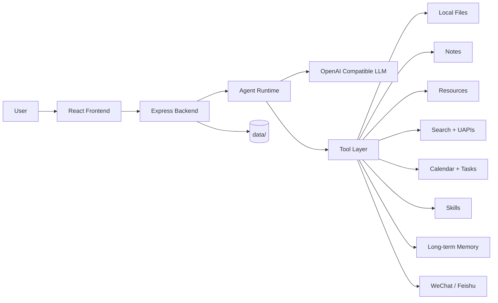

<p align="center">
  <a href="https://github.com/1052666/1052-OS">
    
  </a>
</p>

<p align="center">
  <a href="https://github.com/1052666/1052-OS"></a>
  
  
  
  
</p>

<p align="center">
  1052 OS 是一个本地优先的 AI Agent 工作台，把聊天、文件、笔记、资源、搜索、Skill、定时任务和社交通道组合进同一个可持续使用的桌面系统。
</p>

<p align="center">
  由一名 17 岁学生开发者持续设计、开发与迭代。
</p>

## Community

<table>
  <tr>
    <td width="280" valign="top">
      
    </td>
    <td valign="top">
      <h3>加入社区</h3>
      <p><strong>Telegram 群组：</strong><a href="https://t.me/OS1052">https://t.me/OS1052</a></p>
      <p><strong>微信群：</strong>扫描左侧二维码加入 <code>1052内测测测群</code></p>
      <p>这里会同步项目进展、功能测试、使用反馈和后续迭代方向。</p>
    </td>
  </tr>
</table>

---

## Preview

<table>
  <tr>
    <td width="50%" valign="top">
      
      <br />
      <strong>Chat Workspace</strong>
      <br />
      流式回复、思考折叠、Markdown 渲染、Token 统计、上下文压缩和统一聊天历史都围绕连续对话体验构建。
    </td>
    <td width="50%" valign="top">
      
      <br />
      <strong>Files, Notes, Resources</strong>
      <br />
      Agent 可以读取仓库、操作本地文件、维护资源库、管理笔记目录，并把临时产物放进独立工作区。
    </td>
  </tr>
  <tr>
    <td width="50%" valign="top">
      
      <br />
      <strong>Search + Skills</strong>
      <br />
      内置联网搜索、UAPIs 工具箱、搜索源状态面板、Skill 中心和热更新安装能力。
    </td>
    <td width="50%" valign="top">
      
      <br />
      <strong>Schedules + Channels</strong>
      <br />
      支持日程、单次与循环任务、Agent 回调、通知中心，以及微信 / 飞书等社交通道回写。
    </td>
  </tr>
</table>

---

## What It Is

1052 OS 不是单纯的聊天壳，也不是只会调模型的 Demo。它的核心目标，是让 Agent 真正接触用户的本地工作流，并在受控权限下管理真实文件、真实笔记、真实资源和真实任务。

系统默认采用本地优先思路：

- 聊天历史、设置、资源、Skill、记忆、笔记配置等运行时数据保存在本机 `data/`
- Agent 能力以工具驱动方式暴露，而不是把所有逻辑硬塞进提示词
- 权限默认保守，可在设置中开启“完全权限”
- 搜索、Skill、社交通道、记忆、资源、任务都按模块扩展

---

## Highlights

| Module | What You Get |
| --- | --- |
| Chat | OpenAI 兼容模型接入、SSE 流式输出、思考折叠、上下文压缩、Token 统计 |
| Agent Tools | 本地文件增删查改、按行编辑、仓库读取、资源管理、笔记管理、搜索、终端、图像生成 |
| Repositories | 自动识别本地项目、阅读 README、浏览文件树、聊天内快速跳转仓库页面 |
| Notes | 绑定本地笔记目录，或自动创建 `data/notes/` 作为默认笔记根目录 |
| Resources | 适合保存网址、长文、清单、备注和标签，按单文件条目存储，方便维护与删除 |
| Skills | 本地 Skill 管理、市场搜索、预览、安装、删除、热更新 |
| Search | 聚合搜索、网页阅读、搜索源可视化、启用/禁用管理、UAPIs 搜索优先策略 |
| Toolbox | UAPIs 内置 API 中心，可逐个启用/禁用，并让 Agent 按索引调用 |
| Calendar & Tasks | 普通日程、一次性任务、循环任务、长期任务、Agent 回调与通知回写 |
| Channels | 微信、飞书等外部通道接入，支持统一聊天流回显与任务推送 |
| Memory | 普通长期记忆、敏感长期记忆、建议确认、运行时注入预览 |
| Images | OpenAI 格式图像生成配置与聊天内图片展示 |

---

## Architecture



---

## Tech Stack

### Frontend

- Vite
- React 18
- TypeScript
- React Router
- React Markdown
- Mermaid
- KaTeX

### Backend

- Node.js
- Express
- TypeScript
- OpenAI compatible Chat Completions
- Server-Sent Events
- JSON-based local storage

### Default Ports

| Service | Port |
| --- | --- |
| Frontend | `10052` |
| Backend | `10053` |

---

## Prerequisites

| 依赖 | 版本要求 | 必需/可选 |
|---|---|---|
| Node.js | >= 18 | 必需 |
| Python | >= 3.10 | 仅 SQL 功能需要 |
| uv | latest | 仅 SQL 功能需要 |

> 不使用 SQL 查询/编排功能时，可跳过 Python 和 uv，1052 OS 其他功能正常使用。

### 安装 uv

```bash
# macOS / Linux
curl -LsSf https://astral.sh/uv/install.sh | sh

# Windows (PowerShell)
powershell -ExecutionPolicy ByPass -c "irm https://astral.sh/uv/install.ps1 | iex"

# 或通过 pip
pip install uv
```

### SQL 功能依赖安装

```bash
cd backend
uv sync
```

---

## Quick Start

### 1. Clone

```bash
git clone https://github.com/1052666/1052-OS.git
cd 1052-OS
```

### 2. Install

```bash
cd backend
npm install

cd ../frontend
npm install
```

### 3. Start Backend

```bash
cd backend
npm run dev
```

Health check:

```bash
curl http://localhost:10053/api/health
```

### 4. Start Frontend

```bash
cd frontend
npm run dev
```

Open:

```text
http://localhost:10052
```

### 5. Configure Models

在设置面板中配置：

- `LLM Base URL`
- `Model ID`
- `API Key`
- 是否启用流式输出
- 聊天上下文条数
- 是否开启完全权限
- 图像生成配置
- UAPIs 可选 API Key

---

## Data Directory

运行时目录 `data/` 不需要提交到 GitHub。项目首次运行时会自动创建，常见内容包括：

```text
data/
|-- agent-workspace/
|-- channels/
|-- generated-images/
|-- memory/
|-- notes/
|-- resources/
|-- skills/
|-- chat-history.json
`-- settings.json
```

建议保持这些目录不进仓库：

- `data/`
- `node_modules/`
- `dist/`
- `.env`

---

## Agent Capabilities

### Local File Control

Agent 在权限允许时可管理本地文件，包括：

- 读取与搜索文件
- 新建文件与目录
- 替换文件内容
- 按行插入与按行替换
- 复制、移动、删除路径

### Notes and Resources

- 笔记支持绑定任意本地目录，或自动使用 `data/notes/`
- 资源支持标题、正文、备注、标签和状态
- 资源按条目拆分保存，方便维护和删除

### Search and Toolbox

- 普通聚合搜索适合广覆盖网页查找
- UAPIs 搜索接口适合更聚焦的结果与结构化调用
- 搜索源和工具箱 API 都支持启用 / 禁用

### Scheduling and Callbacks

- 一次性、循环、长期任务
- Agent 回调或终端命令执行
- 结果写回聊天流、通知中心、微信、飞书

### Social Channels

- 微信扫码接入
- 统一聊天回显
- 文本与媒体收发
- 定时任务回推

---

## Roadmap

- 更多社交通道接入
- 更细粒度的权限审计
- 更丰富的 Skill 市场体验
- 更强的笔记检索增强
- 更完整的移动端适配

---

## Contributing

欢迎提交 Issue、建议和 Pull Request。

适合优先参与的方向：

- 前端性能优化
- Agent 工具稳定性
- Search / Skill 生态扩展
- 社交通道增强
- 文档与示例补充

---

## License

This project is licensed under the [MIT License](./LICENSE).
